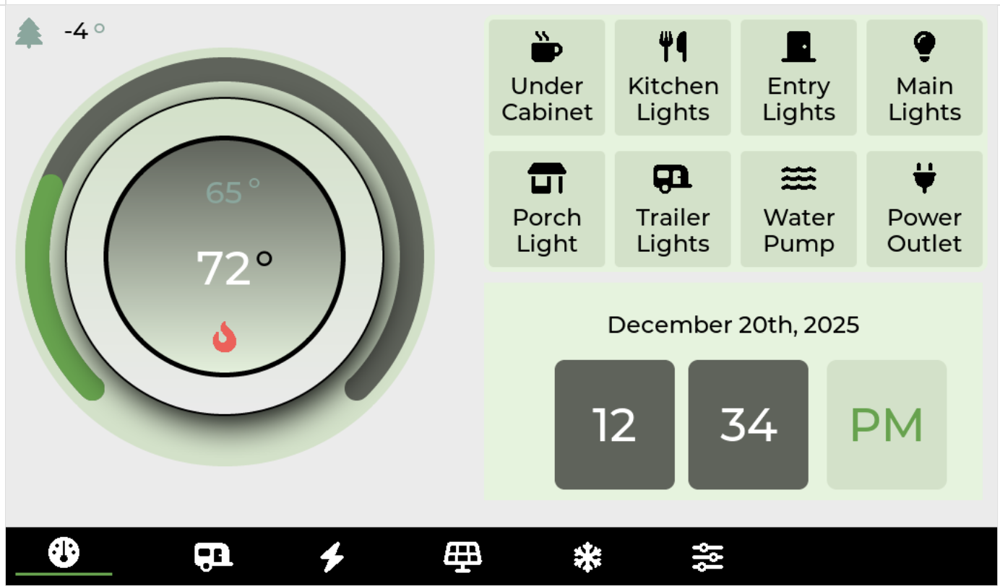

# TrailCurrent Wall Mounted Display

Central control display firmware for an ESP32-P4 with a 7" touchscreen, providing a dashboard for monitoring and controlling devices on the [TrailCurrent](https://trailcurrent.com) CAN bus via WiFi and MQTT.

## Home Screen



## Hardware Overview

- **Microcontroller:** ESP32-P4 (Waveshare ESP32-P4 WiFi6 Touch LCD 7B)
- **WiFi:** Via ESP-Hosted (ESP32-C6 slave over SDIO)
- **Display:** 7" 1024x600 MIPI-DSI LCD with capacitive touch
- **Build System:** ESP-IDF v5.5.1
- **Key Features:**
  - Central dashboard for trailer system monitoring
  - Thermostat with temperature control
  - Eight device control buttons
  - WiFi network scanning, selection, and credential storage (NVS)
  - MQTT client for real-time data communication
  - Screen rotation support
  - Color theme switching
  - Screen brightness and timeout controls
  - NVM-persisted user settings
  - LVGL v8 UI designed with EEZ Studio
  - FreeCAD enclosure design

## Hardware Requirements

### Components

- **Board:** Waveshare ESP32-P4 WiFi6 Touch LCD 7B
- **WiFi Module:** ESP32-C6 (integrated, communicates via ESP-Hosted SDIO)

## Firmware

This project uses ESP-IDF (not PlatformIO).

**Setup:**
```bash
# Install ESP-IDF v5.5.1 (if not already installed)
# See https://docs.espressif.com/projects/esp-idf/en/stable/esp32p4/get-started/

# Set target
idf.py set-target esp32p4

# Configure (optional - sdkconfig.defaults has working defaults)
idf.py menuconfig

# Build
idf.py build

# Flash
idf.py -p /dev/ttyUSBx flash

# Monitor serial output
idf.py -p /dev/ttyUSBx monitor
```

### Firmware Dependencies

Dependencies are managed by the ESP-IDF component manager and resolved automatically during build:

- **[LVGL](https://github.com/lvgl/lvgl)** (v8.4.x) - Light and Versatile Graphics Library
- **[esp_wifi_remote](https://components.espressif.com/components/espressif/esp_wifi_remote)** - WiFi via ESP-Hosted
- **[esp_hosted](https://components.espressif.com/components/espressif/esp_hosted)** - ESP32-C6 slave communication

### MQTT Configuration

The MQTT broker URI in `main/main.c` must be updated to point to your MQTT broker before building.

### WiFi

WiFi credentials are entered through the on-screen UI and stored in NVS (non-volatile storage). No credentials are hardcoded in the source code.

## Project Structure

```
├── ASSETS/                       # UI design assets (images, SVGs)
├── CAD/                          # FreeCAD enclosure design and STL exports
├── DOCS/                         # Documentation and screenshots
│   └── IMAGES/                   # UI screenshots
├── GUI/                          # EEZ Studio UI design files
├── components/                   # Custom ESP-IDF components
│   ├── bsp_extra/                # Board support package extensions
│   ├── mqtt_client/              # MQTT client wrapper
│   └── wifi_credentials/         # NVS-based WiFi credential storage
├── main/                         # Main application source
│   ├── main.c                    # App initialization, WiFi, MQTT, LVGL
│   ├── actions.c                 # UI action callbacks (WiFi, settings)
│   ├── vars.c                    # UI variable bindings
│   ├── idf_component.yml         # Component dependencies
│   └── ui/                       # EEZ Studio generated UI code
├── CMakeLists.txt                # Top-level CMake configuration
├── sdkconfig.defaults            # ESP-IDF configuration defaults
├── partitions.csv                # Flash partition layout (26MB app + 5MB storage)
└── LICENSE                       # MIT License
```

## License

MIT License - See LICENSE file for details.

## Contributing

Improvements and contributions are welcome! Please submit issues or pull requests.
